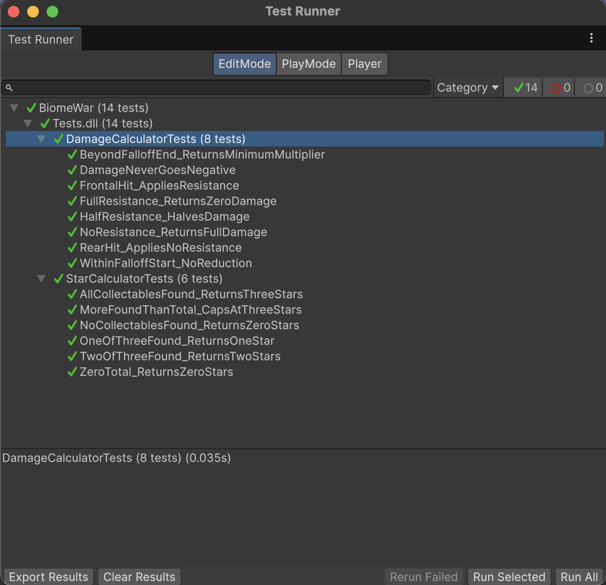

# Biome War

A first-person shooter across five biome-themed levels, built in Unity 6.4 with the Universal Render Pipeline.

Submitted for the **Chronicles of the Lost Dungeon** summative project. The dungeon theme was reinterpreted as a biome campaign — the player fights through beach, forest, desert, snow, and jungle environments, each with a distinct enemy type and escalating difficulty.

---

## Build links

| Platform | Link |
|---|---|
| WebGL (Unity Play) | *[https://play.unity.com/api/v1/games/game/dec84f1f-fb8d-405e-ad74-55cf54085c5d/build/latest/frame]* |
| Mac OS Build | *[https://drive.google.com/file/d/1qQdHK-1MCH-rIivmnFo2YewE6DrSMWdA/view?usp=sharing]* |
| Android APK | *[https://drive.google.com/file/d/1k81vcZb-9ICDCU5ixAyG2fqGilUybs0Y/view?usp=sharing]* |

---

## How to play

| Action | Desktop | Mobile |
|---|---|---|
| Move | WASD / arrow keys | On-screen joystick |
| Look | Mouse | Drag right side of screen |
| Fire | Left click | Fire button |
| Interact | E | Heal button |
| Slam ability | Q | Ability icon |
| Dash ability | F | Ability icon |
| Pause | Esc | — |

Each level opens with a preparation phase before enemies spawn. Use it to explore and collect the three hidden relics — each relic earns one star. Killing every enemy completes the level and unlocks the next. Relics affect your star rating only, so a level can be completed with zero stars.

---

## Levels

| # | Level | Biome | Enemy | Behaviour |
|---|---|---|---|---|
| 1 | Sunken Shore | Beach | Zombie | Chase (slow melee) |
| 2 | Forest Camp | Camp | Skeleton | Chase (fast melee) |
| 3 | Dry Basin | Desert | Mummy | Chase (slow, high health) |
| 4 | Frost Line | Snow | Snowman | Ranged turret (stationary) |
| 5 | Deep Canopy | Jungle | Spider boss | Defensive (frontal damage reduction) |

Difficulty escalates through enemy composition, count, and shorter preparation time rather than through changes to any system.

---

## Architecture

All project code lives in `Assets/_Project/`, separated from imported asset packs.

```
_Project/Scripts/
├── Core/           GameManager, SaveManager, LevelManager, ManagerBase, GameEvents, StateMachine, States
├── Interfaces/      One interface per file
├── Player/          Controller, gun, projectile, health feedback, abilities, interactor
├── Enemies/         Controller, behaviours, states, animator drivers, ground snap
├── Interactables/   Collectible, supply crate
├── UI/              HUD, game screens, main menu, level select, settings
├── Data/            ScriptableObjects, save data, structs
├── Systems/         Object pool, audio, spawner, objective tracker, daily challenge
└── Utils/           Damage calculator, star calculator
```

The guiding principle is that **levels and enemies are data, not code**. Adding a new enemy type or level requires creating a ScriptableObject asset, not modifying any existing script.

---

## Design patterns

### Singleton — `ManagerBase<T>`

A generic base class for global managers. Guarantees a single instance, destroys duplicates placed in multiple scenes, and survives scene loads via `DontDestroyOnLoad`.

Used by `GameManager`, `SaveManager`, `LevelManager`, `PoolManager`, `AudioManager`, `InputReader`, and `DailyChallengeService`.

Managers are singletons; gameplay is not. Gameplay systems communicate through events rather than reaching into managers, which keeps the hidden-dependency problem that singletons are criticised for confined to a small, deliberate set of classes.

### Observer — `GameEvents`

A static event bus. Publishers raise events without knowing who listens; observers subscribe without referencing the publisher.

A single `OnEnemyDefeated` event drives the objective counter, the score, audio, and the boss health bar — none of which hold a reference to the enemy or to each other. The HUD can be deleted entirely and gameplay continues unaffected.

All subscribers pair `OnEnable` and `OnDisable` to avoid stale delegates on destroyed objects.

### Strategy — `IEnemyBehaviour` and `IAbility`

Two applications.

**Enemy behaviours.** `ChaseBehaviour`, `RangedBehaviour`, and `DefensiveBehaviour` are interchangeable objects assigned from an `EnemyConfig` asset at spawn. Five visual enemy types are driven by three behaviour classes — the Zombie and Skeleton share `ChaseBehaviour` with different stats, and the Snowman becomes a stationary turret purely by having a move speed of zero in its config.

**Player abilities.** `DashAbility` and `SlamAbility` implement `IAbility`. `AbilityHolder` collects them with `GetComponents<IAbility>()` and never references either concrete class. Adding a third ability means adding a component, not editing the holder.

### State — polymorphic state classes

Both the game flow and enemy AI use the State pattern implemented as classes, not as an enum with a switch statement.

`IState` defines `Enter()`, `Tick()`, and `Exit()`. `StateMachine` holds one current state and delegates to it with no conditional logic:

```csharp
public void ChangeState(IState next)
{
    if (next == null || next == CurrentState) return;
    CurrentState?.Exit();
    CurrentState = next;
    CurrentState.Enter();
}
```

Game states: `MainMenuState`, `LevelSelectState`, `BriefingState`, `PlayingState`, `PausedState`, `LevelCompleteState`, `GameOverState`.

Enemy states: `IdleState`, `ChaseState`, `AttackState`, `DeadState`.

`GameStateId` exists as an enum, but only as an identifier broadcast to observers so the UI and audio can react. It is never switched on to determine behaviour.

### Object Pooling — `ObjectPool` and `PoolManager`

Projectiles are fired several times per second and destroyed on impact, which would cause continuous allocation and garbage collection. `ObjectPool` maintains a queue of inactive instances and reuses them.

Pooled objects implement `IPoolable` so they reset their own state on spawn and release, rather than the pool needing to know their internals. `PoolManager` keeps one pool per prefab, created on first request.

---

## Interfaces

Each interface is in its own file, in `Scripts/Interfaces/`.

| Interface | Implemented by |
|---|---|
| `IDamageable` | Player health, enemy health |
| `IInteractable` | Collectible, supply crate |
| `ICollectable` | Relic |
| `IAbility` | Dash, Slam |
| `IEnemyBehaviour` | Chase, Ranged, Defensive |
| `IEnemyAnimator` | Animator-driven, procedural |
| `IPoolable` | Projectile |
| `IState` | All game and enemy states |

`IEnemyAnimator` is worth noting. Two of the five enemy models shipped without usable animation clips — the Snowman has no skeleton at all, being a set of separate mesh parts. Rather than restrict the design to animated assets, the animation layer was abstracted: `AnimatorDrivenEnemyAnimator` wraps Unity's Animator, while `ProceduralEnemyAnimator` animates the Snowman's parts directly in code (arm swing on attack, topple and hat detachment on death). Behaviour code calls `PlayAttack()` and is unaffected by which driver is in use.

---

## Events and delegates

Declared in `GameEvents`:

`OnPlayerHealthChanged` · `OnPlayerDamaged` · `OnPlayerDied` · `OnAbilityActivated` · `OnEnemyDefeated` · `OnBossHealthChanged` · `OnBossSpawned` · `OnObjectiveUpdated` · `OnItemCollected` · `OnCollectablesUpdated` · `OnLevelStarted` · `OnLevelCompleted` · `OnLevelUnlocked` · `OnGameStateChanged` · `OnScoreChanged`

---

## Algorithms

### 1. Star rating calculation

**Purpose.** Convert the number of relics collected into a star rating shown on the level complete screen and stored per level in the save file.

**Why this approach.** Written as a pure static function with no Unity dependencies so it can be unit tested directly, and so the rule lives in exactly one place. Star rating appears on the completion screen, the level select buttons, and in the save data — a single source of truth prevents those drifting apart.

**Pseudocode**

```
FUNCTION Calculate(found, total)
    IF total <= 0 THEN RETURN 0
    IF found <= 0 THEN RETURN 0
    IF found >= 3 THEN RETURN 3
    RETURN found
END FUNCTION
```

Implemented in `Utils/StarCalculator.cs`. Six unit tests cover zero collected, all collected, partial collection, zero total, and over-collection.

### 2. Damage calculation with resistance, distance falloff, and directional blocking

**Purpose.** Determine final damage from a base value, the target's resistance, the distance travelled, and — for the boss — the angle of the hit relative to its facing.

**Why this approach.** Damage is applied from several places: the player's gun, enemy melee, enemy projectiles, and the Slam ability's radial burst. Centralising the maths in a pure function means balance changes happen in one place and the behaviour is deterministic and testable. Keeping it free of Unity component references also means it can be exercised in edit-mode tests without instantiating a scene.

The directional component gives the spider boss its mechanic: hits landing within a 90° cone of its facing are reduced by 80%, so the player must flank rather than stand and fire.

**Pseudocode**

```
FUNCTION Calculate(baseDamage, resistance, distance, falloffStart, falloffEnd, minMultiplier)
    IF baseDamage <= 0 THEN RETURN 0

    resistance <- CLAMP(resistance, 0, 1)
    afterResist <- baseDamage * (1 - resistance)

    falloff <- CalculateFalloff(distance, falloffStart, falloffEnd, minMultiplier)

    RETURN MAX(0, afterResist * falloff)
END FUNCTION


FUNCTION CalculateFalloff(distance, start, end, minMultiplier)
    IF end <= start THEN RETURN 1
    IF distance <= start THEN RETURN 1
    IF distance >= end THEN RETURN minMultiplier

    t <- (distance - start) / (end - start)
    RETURN LERP(1, minMultiplier, t)
END FUNCTION


FUNCTION DirectionalResistance(defenderForward, hitDirection, blockAngle, frontalReduction)
    toAttacker <- NORMALIZE(-hitDirection)
    angle <- ANGLE_BETWEEN(NORMALIZE(defenderForward), toAttacker)

    IF angle <= blockAngle / 2 THEN
        RETURN CLAMP(frontalReduction, 0, 1)
    ELSE
        RETURN 0
    END IF
END FUNCTION
```

Implemented in `Utils/DamageCalculator.cs`. Eight unit tests cover no resistance, full resistance, partial resistance, negative input, falloff inside and beyond range, frontal hits, and rear hits.

### 3. Deterministic daily challenge selection

**Purpose.** Choose one modifier from a remotely hosted list such that every player receives the same modifier on the same calendar day, without any server-side logic.

**Why this approach.** A random selection would differ per player and per launch, which defeats the point of a shared daily challenge. Storing state on a server would require a backend. Using the day of the year as an index into the list is deterministic, requires no persistence, needs no coordination between clients, and rotates automatically. Because the modifier list is fetched at runtime, its length can change without a client rebuild — the modulo adapts.

**Pseudocode**

```
FUNCTION SelectForToday(modifierList, utcNow)
    IF modifierList IS EMPTY THEN
        RETURN DefaultModifier    // all multipliers = 1.0
    END IF

    index <- utcNow.DayOfYear MOD LENGTH(modifierList)
    RETURN modifierList[index]
END FUNCTION
```

Implemented in `Systems/DailyChallengeService.cs`. The function is static and takes the date as a parameter specifically so it can be tested without waiting for a particular day.

### 4. Ground alignment raycast

**Purpose.** Place spawned enemies correctly on uneven terrain and keep them on the surface as they move, without giving each enemy a Rigidbody and physics simulation.

**Why this approach.** Enemies are moved directly by their behaviour Strategies, which only handle horizontal motion. Adding Rigidbodies would introduce physics interactions between enemies and cost performance with many agents. A downward raycast in `LateUpdate` — after movement has been applied — is cheaper and fully deterministic. Ray distances are divided by the object's `lossyScale` so the same values work across differently scaled prefabs, and a layer mask excludes other enemies so the ray only ever finds terrain.

**Pseudocode**

```
PROCEDURE LateUpdate()
    scale  <- MAX(0.01, transform.lossyScale.y)
    height <- rayHeight / scale
    length <- rayLength / scale

    origin <- transform.position + UP * height

    IF Raycast(origin, DOWN, length, groundMask) HITS surface THEN
        targetY <- surface.y + groundOffset

        IF current.y > targetY + 0.5 THEN
            current.y <- MOVE_TOWARDS(current.y, targetY, fallSpeed * deltaTime)
        ELSE
            current.y <- targetY
        END IF
    ELSE
        current.y <- current.y - (fallSpeed * deltaTime)
    END IF
END PROCEDURE
```

Implemented in `Enemies/GroundSnap.cs`.

---

## Data persistence

Progression is serialised to JSON at `Application.persistentDataPath/biomewar_save.json`.

Stored: per-level unlock and completion status, star ratings, best score, best time, collected relic IDs, aggregate player statistics, and audio settings.

```json
{
  "SaveVersion": 1,
  "Levels": [
    { "LevelIndex": 0, "Unlocked": true, "Completed": true, "Stars": 3, "BestScore": 1850, "BestTimeSeconds": 142.6 }
  ],
  "CollectedItemIds": ["beach_relic_01"],
  "Stats": { "TotalKills": 47, "TotalDeaths": 2, "TotalScore": 4200 },
  "Settings": { "MusicVolume": 0.7, "SfxVolume": 1.0 }
}
```

JSON was chosen over `PlayerPrefs` because the data is structured and nested — a list of level records each with several fields — which `PlayerPrefs` cannot represent without manual key flattening. It is also human-readable, which made testing progression far easier, and it version-stamps cleanly via `SaveVersion` for future migration.

**WebGL note.** WebGL writes to an in-memory filesystem that is discarded on page refresh unless explicitly flushed to IndexedDB. A small JavaScript plugin (`Assets/Plugins/WebGLFileSync.jslib`) exposes `FS.syncfs`, called from `SaveManager` under `#if UNITY_WEBGL` after each write.

---

## REST API integration

The game fetches a list of daily challenge modifiers over HTTPS at launch, from a JSON file hosted in this repository at `config/challenges.json`.

Each modifier scales enemy speed, health, and damage, plus the score multiplier. The selected modifier is applied where `EnemyController` builds its `EnemyContext` from the config — because enemy stats were already data-driven, the integration required only three multiplications and no changes to any behaviour, state, or spawner code.

**Failure handling.** Every failure path — no URL configured, network error, timeout, malformed JSON, empty list — falls back to a default modifier with all multipliers at 1.0. The game then plays exactly as designed, offline. The failure mode is "no challenge today", never a crash or a broken level.

**On credentials.** The endpoint requires no API key. This is deliberate: any secret shipped inside a client build can be extracted from the APK or WebGL bundle, so the correct approach for a client-only game is to consume endpoints that need no authentication. Adding write access — a leaderboard, for instance — would require a server-side proxy holding the key, which is outside the scope of this project.

---

## Multi-platform support

Built and tested for WebGL, Windows PC, and Android.

Conditional compilation handles genuine platform differences rather than being included for its own sake:

```csharp
#if UNITY_ANDROID || UNITY_IOS
    controlsRoot.SetActive(true);
    Application.targetFrameRate = 60;
    QualitySettings.shadowDistance = 25f;
#elif UNITY_WEBGL
    controlsRoot.SetActive(false);
    Application.targetFrameRate = 60;
#else
    controlsRoot.SetActive(false);
#endif
```

Used for: enabling the touch control canvas, reducing shadow distance and frame rate targets on mobile, cursor lock behaviour (WebGL requires a user gesture before the pointer can be locked), platform-appropriate control text in the level briefing, and the WebGL filesystem sync described above.

Input is abstracted behind a single `InputReader` class. Desktop reads keyboard and mouse; mobile reads virtual fields written by the on-screen joystick and buttons. `PlayerController`, `Gun`, and `AbilityHolder` consume the same properties and contain no platform-specific code.

---

## Testing

Fourteen NUnit tests run in edit mode, in `_Project/Tests/`.

| Suite | Tests | Coverage |
|---|---|---|
| `StarCalculatorTests` | 6 | Zero found, all found, partial, zero total, over-collection |
| `DamageCalculatorTests` | 8 | Resistance bounds, negative input, falloff inside and beyond range, frontal and rear directional hits |



---

## Setup

```
git clone https://github.com/ZeeyahOke/BiomeWar.git
```

Open in **Unity 6.4 (6000.4.5f1)** or later with the Universal Render Pipeline. Open `Assets/_Project/Scenes/MainMenu.unity` and press Play.

---

## Third-party assets

- Nature Biomes Pack (Low Poly) — environments
- Supercyan Character Pack: Zombie Sample — zombie
- Stylized Low Poly Skeleton — skeleton
- Free Mummy Monster — mummy
- Creepy Snowman PBR — snowman
- Fantasy Spider — boss
- Mixamo — retargeted attack and death animations for the mummy
- Simple Input System — mobile joystick
- Assorted free UI, crosshair, health bar, and ability icon packs

Vendor demo scripts were removed from imported packs; only models, rigs, animations, materials, and UI sprites are used.

---

## Known limitations

- Mobile drag-to-look is unreliable in the current build; movement, firing, and interaction work as intended.
